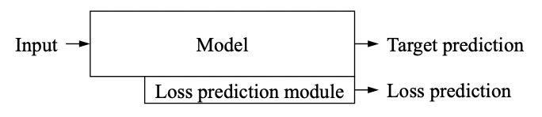
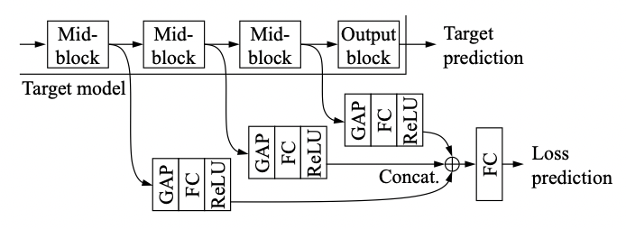

# LEARNIGN LOSS FOR ACTIVE LEARNING

[paper link](http://openaccess.thecvf.com/content_CVPR_2019/html/Yoo_Learning_Loss_for_Active_Learning_CVPR_2019_paper.html)

### 문제

active learning은 학습에 핵심이 되는 데이터에 대한 레이블링을 사람이 직접 맡음으로써 데이터의 레이블 코스트를 효율적으로 사용해
학습하는 방법이다. 기존의 active learning을 위한 방법들은 대부분 특정 task에 맞게 설계되거나 네트워크 규모가 크다면
비효율적이다. 본 논문에서는 loss prediction module을 통해 unlabeled input에 대한 로스를 예측한다.
loss prediction module은 task agnostic하게 적용이 가능하다.

### 방법

제안하는 loss prediction module은 다음과 같다. 기존의 네트워크 자체에 구성되어 loss를 예측할 수 있다.

loss prediction module의 구조를 자세히 보았을 때, 기존 네트워크의 각 레이어들의 집합으로 구성된 각각의 block 단위의
아웃풋을 global average pooling, fully connected, relu layer를 포함한 layer들을 통해 학습하고 concat하여
loss를 예측한다. block은 임의의 layer들로 구성되어 있으며, sequential하게 구성된 각 block의 output을 사용해
loss를 예측한다.

### 공헌

논문의 공헌은 loss에 대한 예측을 제안해 unlabeled 데이터에 대해 active learning의 효과를 얻을 수 있음을 제안한다.
제안하는 loss prediction module은 task, model agnostic하게 적용이 가능하다.

### 의견

제안하는 모델의 novelty는 좋지만, 각각의 block 구성이나 sequential하게 output을 사용하는 이유, block output을
바로 concat해서 하나의 네트워크로 학습하지 않고 각각을 학습후 concat하는 이유 등에 대해 ablation 또는 증명이 부족하다.
