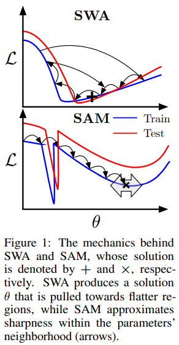
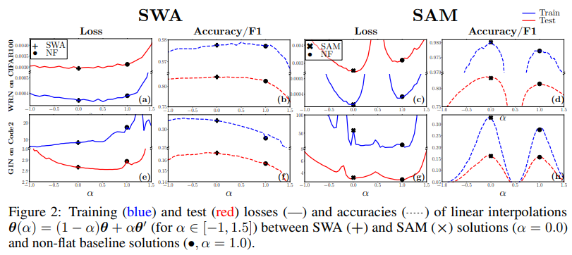
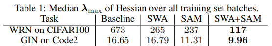
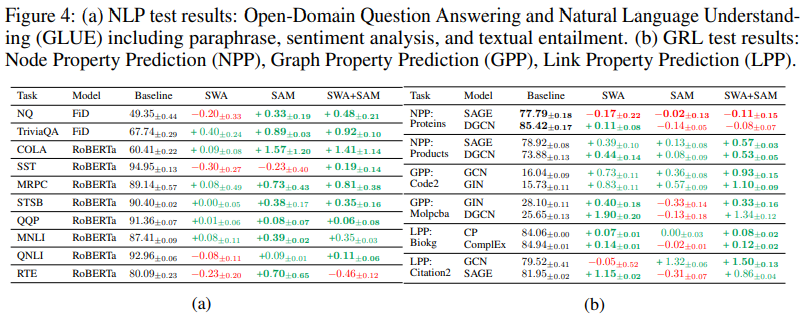

# A FAIR COMPARISON OF TWO POPULAR FLAT-MINIMA OPTIMIZERS: STOCHASTIC WEIGHT AVERAGINV VS. SHARPNESS-AWARE MINIMIZATION

[paper link](https://arxiv.org/abs/2202.00661)

### 문제

뉴럴 네트워크를 학습할 때 optimizer들을 향상시키기 위해 낮은 loss들을 가지는, 즉, flat한 loss를 가지는 parameter들을 찾기위한 노력이 있다.
flat한 loss는 모델의 generalization성능을 향상시키는 것으로 앞선 연구들에서 증명되었다.
본 논문에서는 generalizaton 성능 향상이 뛰어난 두가지 알고리즘 Stochastic Weight Averaging(SWA) 와 Sharpness Aware Minimization (SAM)를
동일선상에서 비교한다.

### 방법

 
SWA는 flat한 minimum지점에서는 gradient가 낮으며 iterate되는 동안 flat한 영역에 많이 머물기 때문에 iterate의 평균이 더 flat한 영역을 찾을 것이라는
아이디어에 착안한다. SWA는 여기서 iterate마다 매번 모델을 저장하고 추론하는 과정을 대신해, 모델을 누적하여 업데이트 시키는 방법을 제안하였다.
SAM은 현재 iterate에서 이웃한 maximum loss를 최소화한다. 즉, loss의 기울기가 가장 큰 곳에서 descent방향을 정하고 loss를 업데이트하여
flat한 영역을 찾는 방법이다.

  
위 실험 결과의 관찰은 다음과 같다.
  
- Obs1 : SWA의 경우 non-flat solution과 동일한 local minima에 존재한다.
- Obs2 : SAM의 경우 non-flat solution과 동일한 local minima에 존재하지 않는다.
- Obs3 : SAM은 saddle point를 찾는다.
- Obs4 : SAM은 SWA보다 더 sharp한 방향에 가깝다. SGD/SWA와 다른 local minima를 찾지만 local minima 내부에서 SGD로 작동(진동)하기 때문.

추가실험으로 SAM을 iterate했을 때 가장 좋은 성능을 보였다.
 

<\p>

flat한 정도를 수치화한 결과는 위 그림과 같다.

결과적으로, SAM은 SWA 보다 더 flat한 영역을 찾지만 더 sharp한 방향에 가까울 수 있다. 

위 그림은 다양한 task 및 모델에서 알고리즘의 성능을 비교한다.
  
### 공헌

그동안 optimizers의 성능 및 할용에 비해 제대로 된 비교가 없었던 SWA와 SMA을 비교하여 올바른 optimizer를 선택하는데 도움을 주었다.
특히 두 알고리즘각각 flat 및 non-flat optimizer 비교와 loss depth비교 및 다양한 task 및 모델에서 알고리즘 성능 비교를 통해 어떤 알고리즘을
  선택해야 하는지에 대한 도움을 준다.

### 의견
  
본 논문은 SWA와 SAM의 깊은 비교를 통해 각 알고리즘이 가지는 특징과 성능 뿐 아니라 task 및 모델에 따른 선택에도 도움을 주어 굉장히 유용하다.
두 알고리즘을 모두 사용하는 것이 대체적으로 좋은 일반화 성능을 보여주었지만 일관적이지 않기 때문에 실제 task에서도 유효한 성능을 보일지는 알수 없어 보인다.
