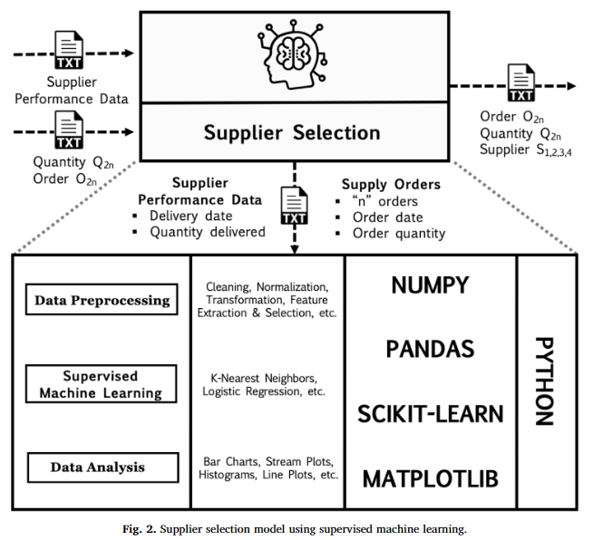
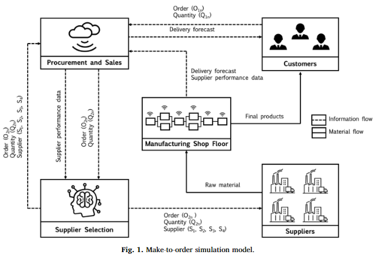

A SUPERVISED MACHINE LEARNING APPROACH TO DATA-DRIVEN SIMULATION OF RESILIENT SUPPLIER SELECTION IN DIGITAL MANUFACTURING

[paper link](https://www.sciencedirect.com/science/article/pii/S0268401219301422)

### 문제

제조회사는 수요,공급,비용,lead time 등에 불확실성을 가진다.
불확실성으로 인한 안정성 하락 및 위험도가 높아짐에 따라서 공급업체 선택이 매우 중요해졌다.
특히 위험도에 따라 탄력성있게(동적으로) 공급업체를 선택해야한다.
digital manufacturing은 동적 순서 할당에 의한 공급 선택의 어려움을 데이터를 활용하여 해결하기위해 등장하였다.
기존의 digital manufacturing의 공급 선택은 주로 지도학습으로 시도되었다.
최근 탄력성있는 공급선택을 위한 연구들이 지속되어왔지만 대부분 공급 중단, 병목현상, lead time, cycle time 등에 대한 예측을 주로 한다.
본 연구에선 데이터를 활용하여 불확실성이 존재하는 공급 퍼포먼스의 위험 프로파일을 분석하여 효율적인 공급업체를 선택하기 위한 차별화된 접근을 제시한다.

### 방법

본 논문에서는 공급 선택 의사결정을 위해 실제 데이터를 사용하여 분석하고 시뮬레이션 데이터를 통해 검증한다.
데이터는 공급업체의 주문일과 주문량, 납품일과 납품량, 시뮬레이션 데이터로 구성되어 있다.
공급 선택 알고리즘은 k-nn모델과 logistic regression모델의 hibrid형태로 사용하였는데, k-nn을 사용해 날짜와 주문량에 따른 공급 퍼포먼스를 맵핑하고
logistic regression을 사용해 정시에 납품이 될 확률을 계산한다. 

실험에서는 실제 공급망환경을 시뮬레이션 형태로 구성하여 제안하는 방법을 검증한다.

### 공헌

공급 선택에 의한 위험도가 supplichain 퍼포먼스에 미치는 영향을 시뮬레이션 기반 실험을 통해 증명하였다. 
탄련적인 공급선택을 위한 알고리즘으로 간단한 machinlearning 알고리즘인 k-nn과 logistic알고리즘을 적용하여 공급 안정성(신뢰도)를 예측하였다.

### 의견

digital manufacturing, 특히 공급선택 문제는 아직 많이 다뤄지지 않은 영역이기 때문에, 머신러닝을 통해 문제를 해결하고, 시뮬레이션 실험을 생성해 
이를 검증한 것에 의의가 있다. 하지만 이러한 방법의 한계는 역시 시뮬레이션에 의한 결과가 실제 환경의 퍼포먼스를 보장하지 않는다는 것이다.
