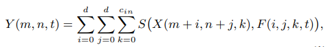
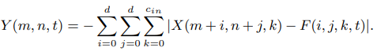

# ADDERNET: DO WE REALLY NEED MULTIPLICATIONS IN DEEP LEARNING?

[paper link](https://openaccess.thecvf.com/content_CVPR_2020/html/Chen_AdderNet_Do_We_Really_Need_Multiplications_in_Deep_Learning_CVPR_2020_paper.html)

### 문제

덧셈연산에 비해 곱셈연산은 계산 복잡도가 훨씬 높다. 일반적으로 딥러닝에서 널리 사용되는 convolution은 input feature와 filter 
사이의 [cross correlation](https://makeabilitylab.github.io/physcomp/signals/ComparingSignals/index.html) 계산, 즉 
일종의 similarity를 계산하는 방법이다.
이때 발생하는 대량의 고비용 곱셈연산을 저비용의 덧셈연산으로 대체하기 위해 본 논문에서는 AdderNets을 제안한다.

### 방법

기존의 convolution 연산은 위 식과 같다 Y는 cross correlation 연산에 의한 similarity를 의미한다.
여기서 x는 input feature, F는 filter를 의미하고, S는 similarity measure로 곱셈연산을 의미한다.

본 연구에서는 위 식과 같이 input feature과 filter 사이의 similarity 연산을 l1 norm으로 정의한다.
음수값으로 고정된 AdderNet의 similarity에 대해 batch norm 등을 적용하여 적절한 범위로 nomalize를 한다.
이때 사용되는 곱셈연산은 아주 적기 때문에 속도에 크게 영향을 미치지는 않는다.

### 공헌

기존 convolution 연산의 filter 계산을 cross correlation연산으로 보아 simlarity measure를 곱셈에서 덧셈으로 대체하였다. 결과적으로 연산속도를 매우 줄였다.

### 의견

아직 다양한 task와 모델들에 실험이 되지 않았지만, 앞으로 비전분야에서 딥러닝 연산을 가속화 시킬 좋은 방법이다.
