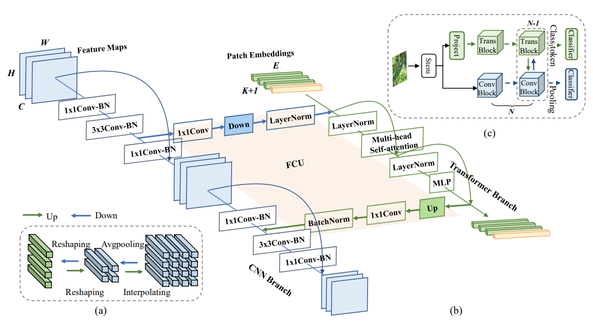

# CONFORMER: LOCAL FEATURES COUPLING GLOBAL REPRESENTATIONS FOR VISUAL RECOGNITION

[paper link](https://openaccess.thecvf.com/content/ICCV2021/html/Peng_Conformer_Local_Features_Coupling_Global_Representations_for_Visual_Recognition_ICCV_2021_paper.html)

### 문제

convolutional neural network(CNN)은 좁은 receptive field로 인해 local정보를 추출하는데 좋지만, global정보를 추출하는데는
네트워크의 뎁스와 downsampling등으로 인해 어렵다. Vision transformer(ViT)의 경우 receptive field를 유지하는 특성으로 인해
global정보를 추출하는데는 유리하지만 local정보를 추출하는 기능은 cnn에 비해 상대적으로 낮다. 본 논문에서는 Confermer라고 하는
cnn과 transformer의 self-attention mechanism의 장점을 모두 취한 hybrid network를 제안한다.

### 방법

본 논문에서 제안하는 conformer는 위 그림과 같다. 입력 이미지는 CNN branch를 통해 순방향으로 진행하는데, 이때
중간 지점에서 동일한 입력이미지의 patch embedding을 가지는 transformer branch로 feature를 공유한다.
이후 cnn branch와 transformer branch는 각각의 학습을 진행하고 transformer branch의 마지막 layer에서 feature를
cnn branch로 다시 전달하여 최종적으로 cnn branch에서 학습을 마무리한다.

### 공헌

본 논문에서는 기존의 cnn과 새롭게 각광받는 transformer기반 모델의 장점을 살려 두 feature를 적절히 섞는 conformer를 제안하였다.

### 의견

두 모델의 feauter를 효과적으로 섞는데는 성공했지만, 필연적으로 두 네트워크의 핵심요소를 모두 반영한 end-to-end 네트워크가
나올 것 으로 기대한다.
