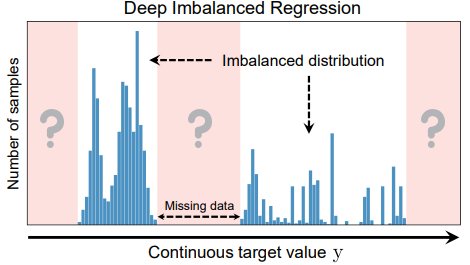
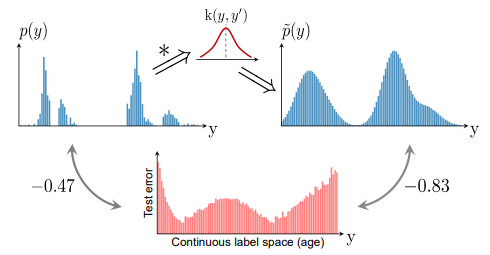
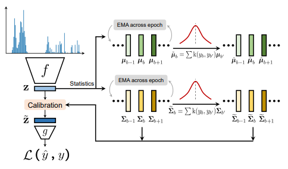

# DELVING INTO DEEP IMBALANCED REGRESSION

[paper link](http://proceedings.mlr.press/v139/yang21m.html)

### 문제

real world의 데이터는 종종 불균형 분포를 나타내며, 특정 대상 값의 관측치가 상당히 적은 경우가 있다. 기존의 불균형 데이터를 처리하기위한
방법들은 범주형 데이터에 국한되었다. 하지만 범주가 연속형인 데이터들은 범주간 경계가 존재하지 않는다. 따라서 본 논문에서는
Deep Imbalanced Regression(DIR)을 제안하여 연속형의 불균형 데이터를 학습하고 특정 대상에 대한 잠재적 누락 데이터를 처리한다. 

### 방법

본 논문에서는 연속형 데이터와 범주형 데이터의 차리에서 착안하여, label과 feature에 대해 distribution smoothing을 제안한다.
위 그림은 연속형 레이블을 가진 데이터의 분포가 불균형할 뿐아니라 일부 누락되어있는 경우를 묘사한다.

제안하는 방법은 먼저 커널을 사용해 데이터의 label의 분포에 대한 스무딩 Label distribution smoothing(LDS)를 수행한다.

다음으로 feature의 분포에 대한 스무딩 feature distribution smoothing(FDS)을 수행한다.
FDS는 feature calibration layer를 통해 수행된다.

### 공헌

불균형 분포를 가진 연속형 데이터에 대해 label과 feature 관점에서 smoothing을 수행해 불균형을 해소하고 효과적으로 학습하였다.

### 의견

비록 범주가 연속형인 데이터에 제한된 연구이지만, 해당 문제를 해결하기 해 feature 분포 및 label 분포 관점에서 smoothing을 제안한 점이
참신하다.
