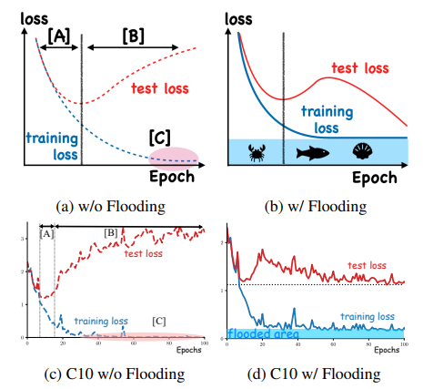
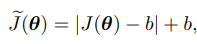

# DO WE NEED ZERO TRAINING LOSS AFTER ACHIEVING ZERO TRAINING ERROR?

[paper link](https://arxiv.org/abs/2002.08709)

### 문제

딥러닝에서 overparameterized 네트워크는 training data를 모두 기억하여 zero training error를 달성할 능력이 있다.
학습에서 이미 training data를 모두 기억하더라도, training loss는 계속해서 0으로 근접하고, 모델을 overconfident하게 만들며 test performance를 하락시킨다.
기존의 regularizers들은 직접적으로 zero training loss를 회피하는 방법들이 아니기 때문에, 일정수준으로 training loss를 유지하도록 hyper parameter를 조절하는 것은
매우 어렵다. 따라서 본 논문에서는 flooding이라고 불리는 training loss의 감소를 막는 기법을 제안한다.

### 방법

본 연구에서 제안하는 flooding은 위의 그림에서 그 효과를 확인할 수 있다.
그림 (b)와 (d)에서 flooding을 적용했을 때 training loss가 일정 수준 이하로 감소하지 않고 유지되며 이는 loss space에서의 random walk 효과를 준다.
따라서 test loss가 기존 loss descent graph에서 처럼 증가하지 않고, 최초 증가했다가 더욱 하락하여 generalization효과를 가짐을 알 수 있다.

flooding의 구현은 매우 단순하다. 위의 식처럼 regularization term b를 통해 일정 loss 이하에서만 작동하는 효과를 보인다.

### 공헌

one line of code를 통해 loss의 regularization을 가능하게 하였으며, 다른 optimizer 또는 regularizer와 같이 사용 가능하다.

### 의견

매우 간단한 regualrization term을 loss에 추가함으로써 generalization 효과를 얻는 아이디어가 매우 참신하다.
loss가 감소되지 않음으로써 overfitting되지 않고 계속해서 gradient를 생산해서 minima를 탐색하는 아이디어같다.
