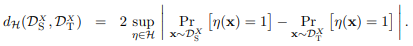
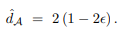
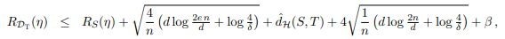
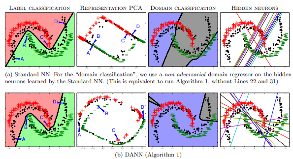

# DOMAIN-ADVERSARIAL TRAINING OF NEURAL NETWORKS

[paper link](https://arxiv.org/abs/1505.07818)

### 문제

일반적인 딥러닝은 training data(source domain)에 대해 학습하고 test data(target domain)에 대해 잘 동작하길 기대한다. 이상적인 경우 source domain이 target domain을 커버하고 있을 수 있으며, 이러한 경우에는 test data에 대해 학습 모델이 잘 동작한다. 하지만 source domain과 target domain이 일부만 겹치는 경우에는(분포가 다른 경우) source domain이 target domain에 잘 동작하도록 하는 domain adaptation이 필요하다. 본 논문에서는 source domain의 feature를 학습할 때 target domain에 좋은 성능을 낼 수 있도록 domain에 dependent하지 않은 feature들을 학습하는 방법, 즉, domain-adversarial한 학습을 제안한다.

### 방법

논문에서 제안하는 방법을 위해 모델은 레이블은 잘 예측도록 학습하되, 학습데이터의 domain은 학습하지 않아야 한다. 즉, 학습 데이터와 테스트 데이터의 domain을 구분하지 못하는 겹치는 영역의 feature를 학습해야 한다. 

두 도메인간의 거리는 위 식에서 처럼 각 도메인에 속할때 risk 차이를 계산하여 구할 수 있다.

본 논문에서는 error term을 사용한 proxy distance를 사용해 두 도메인 사이의 거리를 계산한다.

Test risk의 upper bound는 위 식과 같이 training risk에 domain distance를 더함으로 써 정의하였다.

실험결과에서도 제안하는 방법이 기존 방법에 비해 학습 데이터와 다른 domain의 테스트 데이터에 대해서 더욱 잘 분류하는 것을 확인할 수 있다.

### 공헌

본 논문에서는 모델의 최적화식에 두 도메인간의 distance 최소화를 위한 term을 추가하여  domain에 dependent하지 않은 feature에 대해 학습을 하였다. 결과적으로 domain adaptation 성능을 향상시켰다.

### 의견

논문의 주요점은 학습데이터와 테스트데이터 사이의 domain distance를 최소화하는 것에 있다. 이 방법은 먼저 학습에서 같은 task를 풀지만 다른 도메인에 속하는 데이터를 요구한다. 예를들어, 자연어 데이터를 통해 감정분석을 시도하는데 데이터의 도메인은 도서와 영화 두가지가 필요한 셈이다. 여기서 의문점은 과연 두개 이상의 도메인 데이터에 대해서 제안하는 모델이 잘 동작할수 있을까 이다. 여러 도메인의 high dimension features들에서 distance를 계산하는 것은 상당한 complexity를 요구하겠지만 가능하다면 굉장히 domain adaptation에 robust한 모델을 학습할 수 있을 것이다. 데이터의 domain 수를 늘려나갔을 때 테스트 데이터에 대한 성능을 측정한다면 특정 수 이상의 domain에서 대부분의 테스트 domain에 robust하게 동작하는 지점을 찾을 수 있을 것이다.
