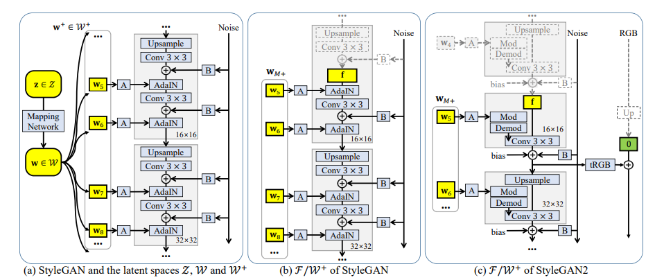

# GAN INVERSION FOR OUT-OF-RANGE IMAGES WITH GEOMETRIC TRANSFORMATIONS

[paper link](https://openaccess.thecvf.com/content/ICCV2021/html/Kang_GAN_Inversion_for_Out-of-Range_Images_With_Geometric_Transformations_ICCV_2021_paper.html)

### 문제

gan inversion이란 기존의 gan과는 반대로 real image를 latent space로 inversion하는 task를 말한다.
성공적인 이미지 semantic editing을 위해서는 바로 이 gan inversion이 필수적이며 이를 위해서 사전학습된 gan 모델의 도메인과 일치하는
in-domain latent code를 찾는것이 중요하다.
기존의 방법에서 이러한 in-domain latent code는 gan 모델의 학습 이미지와 일치하는 범위 내에서만 찾을 수 있었다.
즉 학습이미지와 다른이미지에 대해서는 in-domain latent code를 찾기 힘들기 때문에 성공적인 inversion이 어렵다.
본 논문에서는 이러한 문제를 해결하기 위해, 훈련이미지와 기하학적으로 정렬되지 않은 범위 밖의 이미지에 대해 semantic editing을 가능하게하는
gan inversion방법인 Base-Detail Invert(BDInvert)를 제안한다.

### 방법

semantic editing을 위한 latent code를 이미지속에서 찾기 위해, BDInvert는 이미지를 original latent space에서 alternative latent space로 invert 한다.
즉 일종의 커널 맵핑개념으로 이해할 수 있다.

### 공헌

제안하는 BDInvert를 통해 입력이미지와 다른, 즉, trnaslation, rotation, scaling 등이 적용된 이미지에 대해 효과적으로 style gan을 적용하였다.

### 의견

입력 이미지와 사전학습된 gan 모델의 latent code의 매칭을 시도하였다. latent code 매칭 방법의 발전에 따라 앞으로의 style gan이
매우 발전할 것으로 예상. 또한 자연어 등의 다른 영역에서도 적용되면 충분히 좋은 효과를 보일 수 있겠다.
