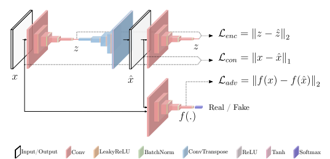

# GANOMALY: SEMI-SUPERVISED ANOMALY DETECTION VIA ADVERSARIAL TRAINING

[paper link](https://arxiv.org/abs/1805.06725)

### 문제

supervised방식의 anomaly task는 정상 데이터를 학습해서 비정상 데이터를 분류할 수 있어야 한다. 즉, 정상데이터의 분포를 잘 학습해야 이 분포와 달라지는 비정상 데이터를 분류할 수 있다. 이를 위해서는, 데이터의 분포를 잘 학습하는 것과 정상 데이터의 분포와 비정상 데이터의 분포를 분류하는 것 두가지 task를 수행해야 한다. 본 논문에서는 정상데이터에 대한 분포를 GAN 모델을 이용해 학습하고 이 분포와 비정상데이터에 대한 분포를 인코더를 통해서 비교하는 모델을 제안한다.

### 방법

논문에서 제안하는 gan 모델의 구조는 위와 같다.
좌측상단의 인코더 및 디코더는 입력 이미지에 대해 latent vector를 만들고, 이를 다시 이미지 형태로 복구하는 generator 역할을 한다. 우측 하단의 discriminator를 통해 입력 이미지와 생성된 이미지를 비교하여 실제 이미지와 유사한 이미지가 생성되도록 학습을 한다. 이 때 원본 이미지와 생성 이미지의 확률분포를 비교하는 adversarial loss 뿐 아니라 실제 데이터와 생성 데이터를 직접 비교하는 contextual loss를 추가함으로써 이미지의 특징(속성)을 잘 학습하도록 한다. 
동시에 우측 상단에서는 생성된 이미지를 다시 인코더를 통해 latent vector로 만들어 generator의 latent vector와 비교하여 유사하게 만든다. 즉 인코더를 generator와 유사한 기능을 하도록 학습한다. 

정상 데이터를 학습할 경우 generator는 입력데이터에 대해 정상 이미지로 generate를 시도할 것이며, 인코더는 마찬가지로 이 데이터를 다시 latent vector로 만들 것이다. 추론과정에서 만약 비정상 데이터가 들어온다면, 이 비정상 데이터는 정상 이미지에 대해 학습된 generator와 인코더를 통해 정상이미지에 가까운 latent vector를 생성하게 된다. 하지만 generator의 latent vector는 
비정상 데이터에 대한 분포를 나타내기 때문에 인코더의 latent vector와 차이가 크게 될 것이고 이를 통해 이상탐지를 수행한다.

### 공헌

Gan과 인코더를 통합한 네트워크를 통해 정상데이터의 분포를 학습하는 과정과 분류하는 과정을 효과적으로 수행하였다. 특히 generator에서 정상데이터에 대한 특징을 학습하는 contextual loss를 추가하여, 비정상 데이터에 대해서도 정상데이터로 generate하도록 하였다.

### 의견

사실 직관적으로 생각했을 때, 단순히 정상데이터의 분포만 학습한다면 비정상 데이터가 들어왔을 때 분포 차이를 알 수 있을 거라 고 생각했는데, 그렇게 하기 위해서는 모델이 비정상 데이터와 비교되는 정상 데이터의 특징들을 잘 학습해야 한다는 전제조건이 있다. 본 논문에서는 generator를 통해 입력데이터를 정상데이터로 복구하도록 한점이 인상깊다. 핵심은 generator가 정상데이터로 생성하도록 feature를 잘 학습하는 것인데, 본 논문에서는 나이브하게 l1 norm사용한 contextual loss를 제안하였다. 여기서 입력데이터와 생성데이터의 contextual feature들을 더욱 다양한 방법으로 비교해준다면 모델의 성능이 훨씬 향상될 것으로 기대된다. 
