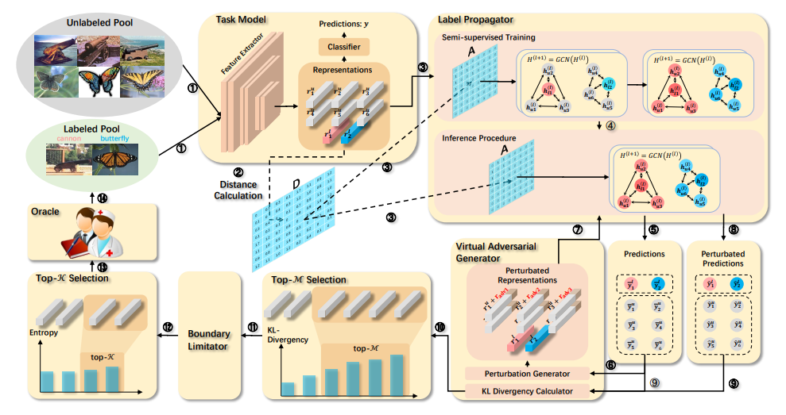

# SEMI-SUPERVISED ACTIVE LEARNING FOR SEMI SUPERVISED MODELS: EXPLOIT ADVERSARIAL EXAMPLES WITH GRAPH-BASED VIRTUAL LABELS

[paper link](https://openaccess.thecvf.com/content/ICCV2021/html/Guo_Semi-Supervised_Active_Learning_for_Semi-Supervised_Models_Exploit_Adversarial_Examples_With_ICCV_2021_paper.html)

### 문제

컴퓨터비전 모델의 성능은 labeled data로 매우 향상되었지만 labeled data수집은 여전히 어려운 일이다.
따라서 labeled data에 대한 의존을 벗어나기 위해 active learning(AL)과 semi-supervised learning(SSL)이 등장하였다.
현재 unlabeled data를 처리하기 위해 SSL-AL기반 방법들이 주류를 이루고 있지만 여전히
ssl과 al의 fully supervised task모델들은 labeled data의 학습을 요구하고 unlabeled data에 대해서는 wasting problem과 같은 문제를 겪는다.
따라서 본 논문에서는 이러한 문제들을 해결한 그래프 기반 SSL-AL 프레임워크를 제안한다. 

### 방법

본논문에서 제안하는 프레임워크는 그림과 같다. 먼저 labeled 데이터와 unlabeled데이터를 SSL로 학습한다.
이때 labeled 데이터의 학습 결과에 대해 gcn을 통해 그래프를 형성하여 데이터를 클러스터링한다.
unlabeled 데이터에 대해서 추론과정에서 마찬가지로 gcn으로 그래프를 형성하는데 이때 형성된 그래프 클러스터에 대해
virtual adversarial generator(VAG)를 통해 데이터의 boundary를 smoothing하고, kl-divergence 매트릭을 통해 가장 분포가 다른, 즉,
가장 분류되기 어려운 경계의 데이터를 찾아 AL을 수행한다.

### 공헌

SSL에서 intra-class similarity와 inter-class similarity의 구별문제를 gcn을 도입하여 해결. VGA기반 AL을 도입하여 SSL을 강화.

### 의견

최근 unlabeled data clustering에 효과적으로 판단되는 GCN을 도입하고, 기존 SSL과 AL이 가지는 한계를 VGA기반 모듈을 통해 효과적으로 해결.
