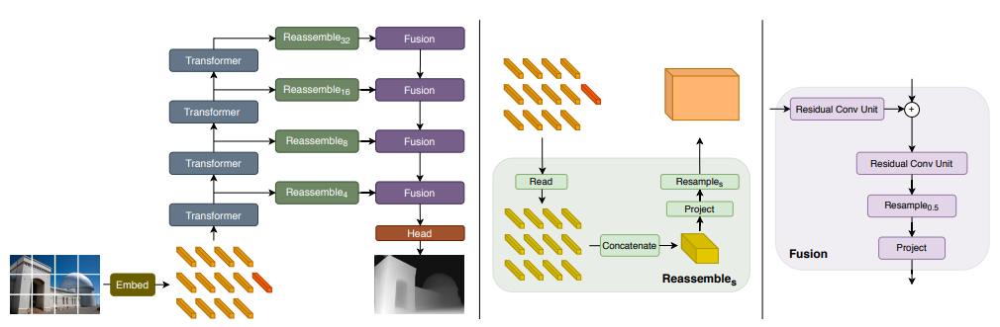

# VISION TRANSFORMERS FOR DENSE PREDICTION

[paper link](https://openaccess.thecvf.com/content/ICCV2021/html/Ranftl_Vision_Transformers_for_Dense_Prediction_ICCV_2021_paper.html)

### 문제

본 논문에서는 기존의 image classification task를 풀었던 vision transformer(ViT)에서 나아가 image dense prediction task를 해결하기 위해
ViT를 사용하였다.

### 방법

본 논문에서 제안하는 ViT를 사용한 dense prediction의 구조는 위와 같다.
먼저 기존의 ViT와 같이 이미지를 패치단위로 분할하고 임베딩을 하는데, 이때 linear projection 또는 
resnet50을 사용해 임베딩을한다.
이후 12개의 transformer layer encorder를 거치고 convolution기반 decorder를 거치는데 encorder에서는 4개의 output만을 사용한다.
decorder에서는 토큰(패치)들을 다시 image like 벡터로 projection한 후 일련의 벡터들을 결합하여 최종 classification head를 통해 
task를 수행한다.

### 공헌

최근 유망한 transformer모델을 denseprediction에 적용하여 문제를 해결하였다. ViT의 cls 토큰의 활용을 시도하였다.

### 의견

transformer모델을 활용하여 dense prediction문제 해결을 시도한 최초의 문제로서는 의미가 있다. transformer encorder의 receptive field
유지에서 그 활용을 착안하였다. 하지만 제안하는 구조 자체는 기존의 cnn기반 framework의 구조를 그대로 가져왔기에 이에 대한 ablation이나 
cnn에서 유망한 FPN등의 방법들을 적용해볼 필요가 있다. 또한 transformer의 장점을 살려 backbone이 아닌 neck 으로의 활용도 고려된다.
