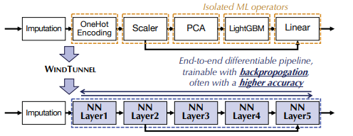

# WINDTUNNEL: TOWARDS DIFFERENTIABLE ML PIPELINES BEYOND A SINGLE MODEL

[paper link](https://dl.acm.org/doi/abs/10.14778/3485450.3485452)

### 문제

최근 딥러닝을 통해 데이터를 분석하는 많은 연구들이 수행되었지만 여전히 정형데이터에 관해서는 머신러닝이 훌륭한 성능을 보이고 있다.
머신러닝은 최소 수십개에서 최대 수백개의 operator가 조합되어 사용되는데, 이때 문제를 해결하기 위해 파이프라이닝을 구성하는 operator는 개별적으로 학습되며
전체 네트워크를 목적에 맞게 tuning하기가 어렵다. 따라서 본 논문에서는 기존 머신러닝의 파이프라인을 미분가능한 딥러닝기반 모델로 변환하는 방법 windtunnel을 제안한다.

### 방법

본 논문에서 제안하는 windtunnel의 구조는 위 그림과 같다. windtunnel은 기존 ML기반의 파이프라인을 미분가능한 뉴럴네트워크로 변경하여 end-to-end
학습을 가능하게 한다.
특히, 저자는 기존 ML 파이프라인을 구성하고있는 Arithmetic Operators, Algorithmic Operators(Gradient Boosting Decision Tree, categorical features)에
대해서 뉴럴네트워크로 변환하는 방법을 제안하였다.

### 공헌

본 논문에서 제안하는 windtunnel은 미분불가능한 함수들을 미분가능한 뉴럴네트워크로 변환함으로써 task에 대한 end-to-end backpropagation과정을 통해
전체 네트워크를 최적화할 수 있다. 또한 방대한 데이터를 통해 fine-tuning이 가능해졌다.

### 의견

본 논문에서는 기존의 정형 데이터에 효과적인 ML operator를 딥러닝으로 변환함으로써 ML의 성능을 유지하면서 딥러닝의 end-to-end학습과 fine tuning의 장점까지
얻었다. ML과 딥러닝의 장점을 모두 취한점이 참신하지만 실험에서 보여준 preprocessing, GBDT 등으로 구성된 파이프라인은 제안하는 windtunnel의 
robustness를 증명하기에는 부족하다는 생각이 든다. 
