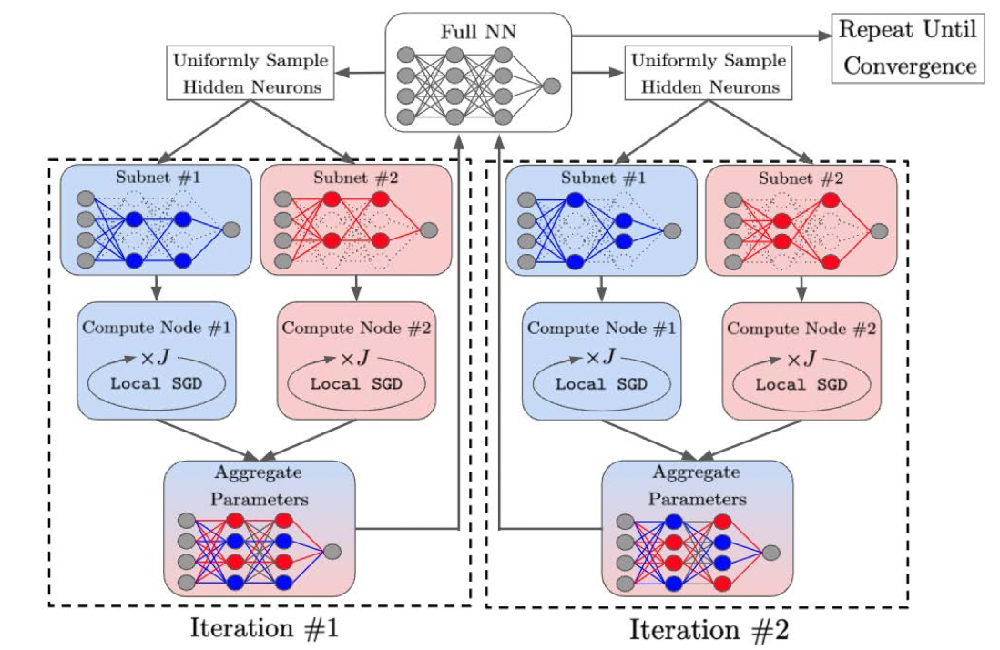

# DISTRIBUTED LEARNING OF FULLY CONNECTED NEURAL NETWORKS USING INDEPENDENT SUBNET TRAINING

[paper link](https://dl.acm.org/doi/abs/10.14778/3529337.3529343?casa_token=Em4eC01TaVkAAAAA:UuZPmFK22tUih80uXyilQa1wUNy5ZMIHFCalht1jcfxX736Y_rOONhzZ-bT2XRVhf-TlsMWQzsHZRuM)

### 문제

분산학습에는 선택적인 상황과 강제적인 상황이 있다. 선택적인 상황은 메모리 제한 또는 시간적인 효율을 위해 분산학습을 수행한다. 강제적인 상황의 경우
데이터가 분산되어있고 데이터 보호(data privacy)가 필요한 경우가 있다. 강제적인 상황은 대게 컴퓨팅 자원 또는 네트워크 환경 제약으로 인해 이상적이지
않은 환경이 대부분이다. 강제적 상황의 경우 데이터 분산과 모델 분산의 선택지가 있다. 데이터분산의 경우 컴퓨팅 노드에서
모델 전체를 서버로 전송해야하기 때문에 네트워크대역이 제한될때의 문제가 크다. 모델분산의 경우 컴퓨팅 노드에 데이터가 공유되어야하며
모델 업데이트시 동기화가 필요하기 때문에 서버와 컴퓨팅노드간 세밀한 커뮤니케이션이 요구된다. 따라서 본 논문에서는 데이터분산과 모델분산의 장점을 결합한
IST(Independent Subnet Training)를 제안한다.

### 방법

본 논문에서 제안하는 IST는 위의 그림과 같다. IST는 fully connected layer만을 분산시키며 각 컴퓨팅 노드로 중복되지않은 subnet을 할당한다.
각 subnet은 local sgd를 통해 학습되며 서버에서 재구성되고 re-sampling 과정을 통해 배포된다. 
IST는 모든 뉴런의 학습을 보장하며 컴퓨팅 노드간 중복된 뉴런할당을 피한다.

### 공헌

본 논문에서는 데이터분산과 모델분산의 장점을 결합한 IST를 제안한다. IST는 fcl을 중복되지않은 subnet으로 컴퓨팅 노드에 분산시키며 
줄어든 모델의 크기로 인해 노드간 커뮤니케이션 오버헤드 및 연산을 감소시킨다.

### 의견

본 논문에서 제안하는 모델의 분산 방법은 기존의 fc 또는 conv모델의 연산 분산을 시도했던 연구들에서 제안되었던 아이디어이지만 
제안하는 방법의 정의 및 실험, 부록을 통한 이론적인 분석들이 연구의 가치를 높인 것 같다.
