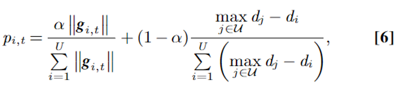
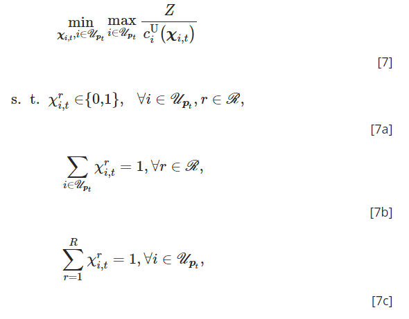

# COMMUNICATION-EFFICIENT FEDERATED LEARNING

[paper link](https://www.pnas.org/doi/abs/10.1073/pnas.2024789118)

### 문제

연합학습은 보통 제한된 communication network에서 수행된다. 예를들어, 무선 네트워크의 경우, bandwidth와 power가 매우 제한된 환경이기
때문에 병목현상이 발생하여, 일반적인 학습보다 더 오래 걸릴 수있다. 본 논문에서는 이같은 문제를 해결하기 위해 communication-efficient
FL framework를 제안한다.

### 방법

Communication-efficient FL framwork는 세가지 방법을 통해 문제를 해결한다.

1. Probabilistic device selection scheme

확률함수를 통해 모델 업데이트에 참여할 디바이스를 선택한다. 식 6의 좌항은 로컬 모델의 업데이트 정보를 의미하고, 우항은 서버와 엣지 디바이스 사이의 거리를 나타낸다. 즉 모델의 업데이트 정보와
거리를 파라미터 알파를 통해 반영하여 연합학습의 정확도와 수렴속도를 모두 향상시킨다.

2. Quantization method to reduce the volume of the model parameters

모델 업데이트 정보를 주고받을 때, 네트워크 전송 지연이 발생하기 때문에 모델을 압축(양자화)하여 전송한다. random latice quantization을 사용한다.
이때 서버와 클라이언트가 동일한 random seed를 가지고 있어야 하는데, 연합학습은 서버와 클라이언트 지속적으로 정보를 주고받기 때문에 공유가 가능하다.

3. Efficient wireless resource allocation scheme

네트워크 리소스를 최적화 한다. 식 7의 분자 Z는 전송을 위한 bit 수, 분모는 디바이스 i의 data rate를 의미한다.
즉 probabilistic device selection의 확률함수에 의해 선택된 디바이스들의 모델 업데이트정보 전송을 보장(최대화)하면서
네트워크 리소스 할당을 위한 파라미터들의 최소화를 통해 최적화를 한다. 

### 공헌

연합학습에서 네트워크 통신의 병목현상을 효과적으로 해결하기 위해, 확률적 디바이스 선택, 모델 압축, 네트워크 리소스 관리를 적용하였다.
ablation study를 통해 제안하는 시스템의 각각의 방법이 효과적임을 증명하였다.

### 의견

확률적 디바이스 선택은 서버와 클라이언트의 물리적 거리를 알아야 한다는 제약이 있다. 
실제환경에서는 몇번의 통신시간 측정을 통해 거리를 측정하여 사용할 수 있을 것 같다.
모델의 손실 크기를 도입하는 방법은 기존에 존재했지만, 거리와 동시에 적용한 점은 참신하다.
모델 압축 또한 일반적인 방법이지만, 실험을 통해 연합학습에서 모델 압축이 가지는 정확도 손실 및 회복에 대한 해석은 좋다.
리소스관리에서도 디바이스 선택방법을 뒷받침하여 효과적으로 시간을 단축시켰다.
