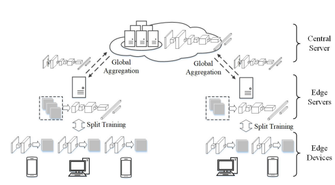

# EDGEFED: OPTIMIZED FEDERATED LEARNING BASED ON EDGE COMPUTING
[paper link](https://ieeexplore.ieee.org/abstract/document/9260194)

### 문제

기존의 연합학습의 edge device역할을 하는 mobile device들은 많은 연산이 필요하고, global model update에 많은 시간이 필요했다.
본 논문에서는 edge computing에 기인하여, 기존의 mobile device에서 전적으로 수행되던 local model의 업데이트과정을 분리하는 EdgeFed를 제안한다.
mobile device에서 수행되는 local model의 output은 edge server로 aggregate되며, edge server에서 나머지 연산을 부담한다.

### 방법

EdgeFed는 training을 위한 model을 분리하여 edge device에서 일부 수행하고 output을 aggregate하여 edge server로 전송한다.
edge server에서는 전송받은 output을 나머지 model을 통해 학습하고 edge device와 통신하며 local update를 수행한다.
또한 central server를 두어 edge server의 aggregated된 model 정보를 global model로 업데이트한다.

### 공헌

모델의 분리 구조를 제안해 mobile device의 연산을 병렬화하고 edge server와의 협업 및 근거리 통신으로 효율을 높였다.

### 의견

이 논문의 아이디어는 좋지만 실험에서 기존의 FedAvg와 정확한 비교가 되지 않았다. 동일 학습량 비교가 아니며, mobile device로 인한 batch를 다르게 가져가고,
local round 수를 늘려 성능이 효과적인것 처럼 나타냈다. 하지만 기존 FedAvg에서 epoch을 늘리는 편이 더욱 효과적일 것이다. 본 논문의 구조는
모델의 분리와 mobile device의 병렬연산 효과를 보이지 않고 특정한 케이스에서의 이득만을 보여주었다.
