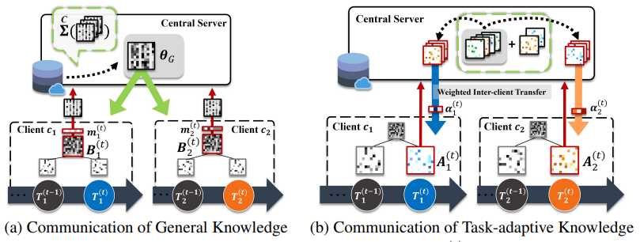
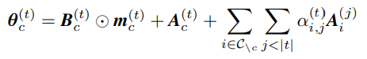

# FEDERATED CONTINUAL LEARNING IWTH WEIGHTED INTER-CLIENT TRANSFEER

### 문제

continual learning 관점에서 연합학습은 각 클라잉너트가 지속해서 새로운 domain 또는 task에 대한 학습을 하기 때문에
각 클라이언트에서 inter-client knowledge transfer가 발생하는 한편 inter-client interference도 발생한다.
본 논문에서는 클라이언트간  knowledge transfer는 최대화 하면서 interference를 최소화 하기 위해
모델 decompose를 통한 framework를 제안한다. 

### 방법

본 논문은 모델을 크게 general knowledge와 task-adaptive knowledge로 분해하여 정의한다.
먼저, general knowledge의 경우 클라이언트가 글로벌 모델을 학습 후 각레이어마다 학습 가능한 mask를 적용시켜 서버로 보내고
이는 취합되어 글로벌 파라미터가 되어 다시 클라이언트로 배포된다. 여기서 mask는 각 클라이언트의 task를 위해 최적화되기 때문에
global knowledge를 얻으면서도 현재 task와 관련있는 knowledge만 선택적으로 얻을 수 있도록 학습된다.
task-adaptive knowledge의 경우 현재 private data를 학습한 파라미터에서 sparse한 parameter를 서버로 보낸 후 가중합되어 다시
클라이언트로 배포된다. 이는 각 다른 task를 학습한 클라이언트로부터 attention을 적용하여 효과적으로 inter-client knowlege를 얻기
위함이며, 클라이언트는 선택적으로 relevant task-adaptive가 가능하다. 이 때 sparse한 task-specific parameter는 random으로 선택된다.

요약하자면, general knowledge는 mask를 통해 학습되어지며, task-adaptive knowledge는 random으로 업데이트 된다.

### 공헌

제안하는 방법을 통해 continual learning 관점의 연합학습에서 현재 task에 필요한 knowledge를 효과적으로 학습하고,
다른 task로 부터 필요한 정보를 선택적으로 얻을 수 있다. 또한 sparse한 parameter 교환을 통해 communication effcient하다.

### 의견

본 논문에서는 general performance를 위한 모델의 파라미터를 학습하여 교환하고, 또한 각 task를 위한 parameter가 
다른 클라이언트에도 도움이 어느정도 있을거라 가정하여 이를 학습하였다.
task-specific한 모델을 로컬에서만 학습하지 않고, 다른 클라이언트로부터 attention을 통해 정보를 얻은 점이 의미있다.
이 두가지 task를 위한 모듈을 하나로 융합하면 좋은 시도가 될 것 같다.
