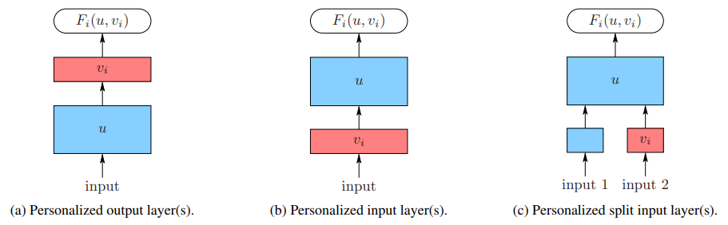
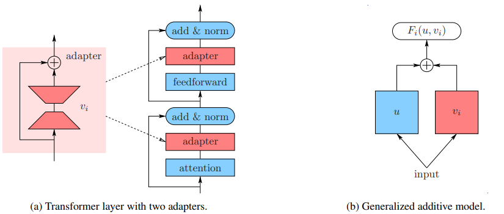

# FEDERATED LEARNING WIRH PARTIAL MODEL PERSONALIZATION

[paper link](https://proceedings.mlr.press/v162/pillutla22a.html)

### 문제

연합학습에서는 클라이언트의 모델을 average하여 federation효과를 얻으면서도, 일부 모델을 private data에 대해서만 학습하여 partially personalized하려는 시도가 있다.
본 논문에서는 연합학습의 partially personalized 모델을 정의하고 personlized layer와 generalized layer를 simultaneous하게 업데이트하는 것과 alternative하게 업데이트하는 것의
차이를 비교한다.

### 방법

본 논문에서 제안하는 연합학습의 partially personalized 모델의 구성은 위 그림과 같다.
(a)는 output layer가 personalized되어있는 경우, (b)는 input layer가 personalized되어있는 경우, (c)는 feature extraction 역할을 하는 input layer를
personalized layer와 generalized layer로 분류한경우이다.

personalized layer가 vertical하게 구분되어 있는 경우, encoder, decoder 구조를 사용한다.
딥러닝 네트워크의 input layer는 low level feature를 다루며 general insight를 다루고 주로 feature extraction 역할을 한다.
반면 output layer쪽은 high leel feature를 다루며 complex pattern recognition을 다룬다.
이에 맞춰 본 논문에서는 encoder를 통해 feature의 representation을 학습하고 decoder를 통해 generate를 할 수 있도록 의도하였다.
split input layer의 경우 일반적인 concatenation을 통한 additive model을 사용하였다.

### 공헌

본 논문에서는 연합학습에서 partially personalized model에 대해 정의를 하고 이에 대한 효과를 최대화 할 수 있는 심플한 모델의 구조를 선정하여 실험을
진행하였다. 또한 모델의 업데이트를 simultaneous와 alternative한 방법으로 나누어 효과를 확인하였다.

### 의견

제안하는 구조에 대해 각 ablation실험을 통해 어떤 구조가 adapter구조(split input)가 general한 성능이 좋고, 또 alternative한 학습방법이 제안하는 구조에 효과적임을 증명하였다.
사실 본 연구는 feature의 level이 모델의 general한 성능에 어떠한 영향을 미치는지보다는 정의한 partially personalized모델과 학습방법에 대해 초점을 맞추고 있는데
feature level에 따른 generalization효과에 대한 연구가 별도로 진행된다면 제안하는 구조에 더욱 효과적으로 적용이 가능할 것 같다.
