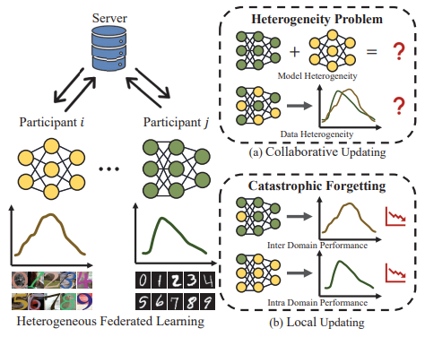
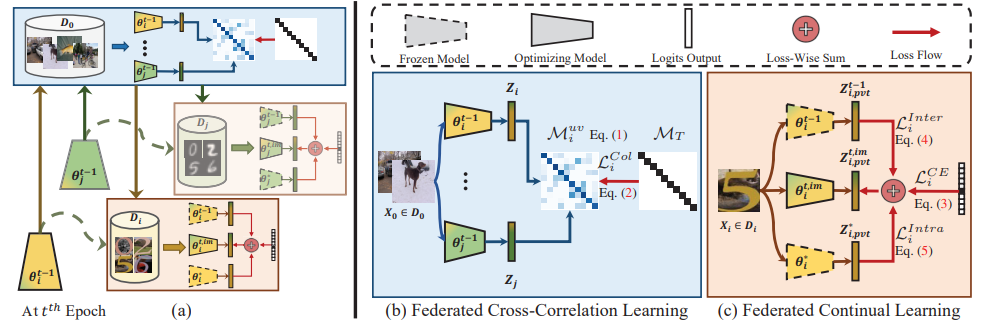
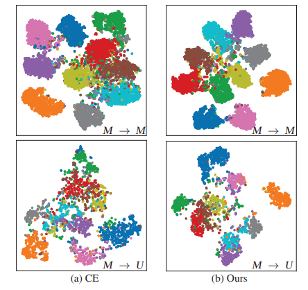

# LEARN FROM OTHERS AND BE YOURSELF IN HETEROGENEOUS FEDERATED LEARNING

[paper link](https://openaccess.thecvf.com/content/CVPR2022/html/Huang_Learn_From_Others_and_Be_Yourself_in_Heterogeneous_Federated_Learning_CVPR_2022_paper.html)

### 문제

연합학습은 participants들의 collaborative updating과 local updating을 포함하는 distributed learning의 중요한 패러다임이다.
연합학습이 해결해야할 문제에는 대표적으로 heterogeneity problem과 catastrophic forgetting이 있다.
먼저, heterogeneity problem은 non-iid 데이터와 heterogeneous architecture로 인해 모델이 다른 domain의 데이터에 대해 성능 저하를 겪는 문제를 말한다.
다음으로, local update에서 모델은 private data에 overfit하여 이전 학습을 잊는 catastrophic forgetting 문제를 겪는다.
따라서 본 논문에서는 연합학습에서 위의 두가지 문제를 해결한 FCCL(Federated Cross Correlation and Continual Learning) 방법을 제안한다.

### 방법

FCCL은 unlabeled public data로부터 cross-correlation matrix를 형성하여 domain shift상황에서 generalizable representation을 학습한다.
또한 catastrophic forgetting문제를 해결하기 위해 FCCL은 local updating에서 inter, intra domain 정보를 활용한 knowledge distillation을 사용하여 학습한다.

연합학습은 participants의 모델들을 aggregate해 업데이트하는 collaborative updating 과정에서 각기 다른 데이터 domain을 가지는 heterogeneity problem을 겪는다.
participants의 local updating과정에서는 private data를 학습하는 과정에서 inter domain 정보를 잃고 collaborative updating으로 부터 
intra domain 정보를 잃는 catastrophic forgetting 문제가 발생한다.

본 논문에서 제안하는 전체 프레임워크는 위와 같다.
제안하는 연합학습의 participants들은 각기 같은 task의 다른 domain data를 학습한다. server에서 collaborative updating을 할 때,
각 participants의 logits output을 사용해 domain간의 corrleation matrix를 계산하여 data heterogeneity에 대한 영향을 줄여 업데이트를 한다.
이후 participants로 모델을 배포하고, 배포된 모델에 대해 inter + intra + cross entrophy loss를 계산하여 최적화한다.
inter loss는 다른 domain의 모델들과 차이를 줄인다. intra loss는 pre trained모델을 사용하여 intra domain을 강화한다.
cross entrophy loss는 priviate data에 대한 학습을 진행한다.

실험결과, intra domain에서도 분류 성능이 향상되었으며, 특히 inter domain에서 분류 성능이 크게 향상되었다.

### 공헌

heterogeneity문제를 해결하기 위해 unlabeled public data와 self-supervised learning방식을 사용하였다.
catastrophic forgetting 문제를 해결하기 위해 inter, intra domain knowledge distillation을 사용하였다.
두가지 이미지 분류 task에 대한 실험을 진행하였다.

### 의견

본 논문은 연합학습의 핵심 문제인 heterogeneity와 continual learning 관점에서의 문제를 효과적으로 해결하였다.
real world에서는 논문에서와 같은 정석적인 domain shift가 아닌 복잡한 데이터와 상황이 존재하기 때문에 직접적인 적용은 어려울 수 있지만
충분히 효과적인 아이디어인 것 같다.
여기에 추가적으로 실제 실험환경에서 발생할 수 있는 통신환경을 고려한 실험이 진행된다면 더욱 좋은 논문이 될 것 같다.
