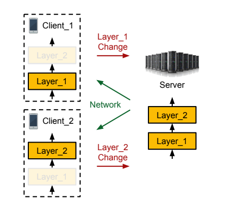

# PARTIAL VARIABLE TRAINING FOR EFFICIENT ON-DEVICE FEDERATED LERANING

[paper link](https://ieeexplore.ieee.org/abstract/document/9746836?casa_token=_5y5S8lpX10AAAAA:fiAOSQMBwyJHn4ob8EmGIPMXuSldbZ2t4SNGkCfZDowbYNtDCEmjmDB8cpRygFf_OmMZOTvwmFE)

### 문제

연합학습은 엣지디바이스에서 학습을 담당하기 때문에 엣지 디바이스의 메모리 제한 문제와 서버와의 커뮤니케이션 비용을 항상 고려하여야 한다.
본 논문에서는 이를 고려해 엣지 디바이스에서 학습 및 서버로 전송하는 모델을 전체 모델의 일부로 제한시키는
Partial Variable Training(PVT)을 제안한다.

### 방법

PVT는 그림에서처럼 클라이언트마다 가지고있는 모델의 일부를 부분적으로 학습하여 서버로 전송하고 이를 취합한다.
실험에서는 학습하는 모델 parameter의 양을 점진적으로 늘려가며 성능과 비용의 관계를 측정하였다.

### 공헌

연합학습의 메모리와 전송비용에 관한 문제를 partial training을 통해 해결하고, 이에 대한 trade-off 관계를 분석하였다.

### 의견

단순히 모델의 크기에 따라 학습성능비교를 한 점이 아쉽다. semi-supervised learning과 같이 특정 데이터에 대해 학습하고
이에 관련한 parameter들을 선택적으로 업데이트 할 수 있다면 더욱 좋은 연구가 될 것 같다.
