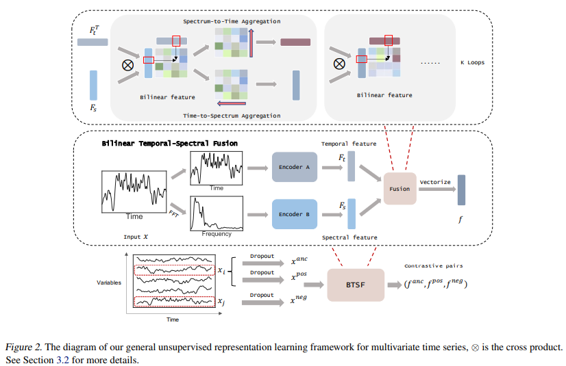

# UNSUPERVISED TIME-SERIES REPRESENTATION LEARNING WITH ITERATIVE BILINEAR TEMPORAL-SPECTRAL FUSION

[paper link](https://proceedings.mlr.press/v162/yang22e.html)

### 문제

unsupervised/self-supervised time series representation learning은 복잡한 역학과 sparse한 annotation으로 인해 풀기 어려운문제다.
기존의 방법들은 주로 segment-level contrastive learning을 통해 문제 해결을 시도하였다. 이 방법은 time-based augmentation을 사용하여
segment단위로 positive와 negative를 샘플링하고 활용하였으나 samplig bias 문제를 가진다. 또한 segment-level sampling은 
global semantical information을 손실하는 문제를 야기한다. 따라서 본 논문에서는 sampling bias문제를 해결하기 위해 
time series데이터의 temporal 및 spectral features를 동시에 활용한 iterative bilinear temporal-spectral fusion 방법을 제안하고, 
long-term dependency를 고려하여 instance-level augmentation테크닉을 제안한다. 

### 방법

iterative bilinear temporal-spectral fusion(BTSF)는 signal 데이터에서 raw feature(temporal)와 fast fourier transform(FFT) feature를 각각
encoder를 이용해 학습 후 융합한 time-frequency feature를 사용한다. time-frequency feature의 representation을 높이기 위해 BTSF를 iterative하게
학습한다. global semantic information을 위해 signal 데이터의 전체를 사용한 instance-level augmentation을 사용한다. 

### 공헌

BTSF를 통해 temporal feature와 spectral feature를 동시에 사용하는 방법을 제시하고, 좋은 성능(representation)을 보였다. 또한 global semantic
information 보존을 위해 instance-level augmentation을 제안하였다. 

### 의견

feature에서 직접 spectral feature를 분리하여 사용한 점은 참신하다. 하지만 end-to-end학습이 아니기 때문에, encoder를 적절하게 사용한다면 
단일 network 내에서 충분히 같은 효과를 보여줄 수 있을 것 같다. 
