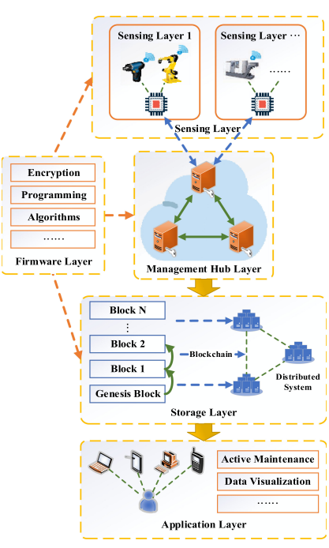
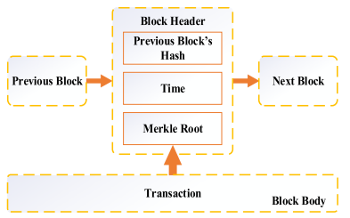

# A BLOCKCHAIN-BASED SOLUTION FOR ENHANCING SECURITY AND PRIVACY IN SMART FACTORY

[paper link](https://ieeexplore.ieee.org/abstract/document/8621042?casa_token=Bbqr_tw9a0gAAAAA:sEpv581fQKcm4YvOBJWLDtnyBWVowyC6gdSg2MErU3n8-fpk1JprBi91o-Qs40UAYAVU-tieVug)

### 문제

산업용 사물인터넷(IIoT)는 스마트 팩토리 구현의 핵심 요소. 대부분의 IIOT 구조 및 기반 장비의 한계로 인해 보인이 아주 취약함.
특히 기존의 IIoT가 가지는 중앙집중식 클라우드 기반 아키텍처는 보안에 매우 취약함.
본 논문에서는 블록체인 기반 구조를 IIoT에 적용하기 위해 security and privacy를 보장하는 multicenter partially decentralized 구조를 소개한다.

### 방법

본 논문에서 제안하는 탈중앙화 시스템은 5개의 레이어로 구성된다 (Sensing Layer, Management Hub Layer, Firmware Layer, Storage Layer, Application Layer).

- Sensing Layer : 다양한 센서와 최소 한 개의 마이크로 컴퓨터를 포함
- Management Hub Layer : 데이터 분석, 암호화, 저장 등을 수행
- Storage Layer : 데이터 센터의 역할을 수행
- Firmware Layer : 위의 세 레이어를 효과적으로 보완하도록 제어
- Application Layer : 사용자에게 서비스 제공
  
이중 Sensing, Management Hub, Storage Layer는 intranet에서 데이터 수집 및 저장기능을 중심으로 동작한다.
Management Hub, Application Layer는 extranet에서 유저 서비스 제공을 위한 데이터 활용 중심 기능으로 동작한다. 
  

블록체인은 storage layer에 저장되며 기존의 블록체인과 동일한 시스템 유지.

### 공헌
  
IIoT 아키텍처의 주요 요구사항 3가지에 대해 블록체인을 도입함으로써 충족시켰다.
  
- Confidentiality (비밀보장) : 허락된 사용자만 접근 가능
- Integrity (오전성) : 송수신된 데이터에 변동성이 없음을 보장
- Availability (이용가능성) : 각 서비스 및 데이터 이용가능성

### 의견
  
아키텍처에 블록체인을 적용하여 효과적인 시스템 구축. 하지만 scalability가 medium으로 평가된점에서 블록체인의 장점인 scalability가 높아질 수록 
  보안 성능이 증가하는 점과 상충.
