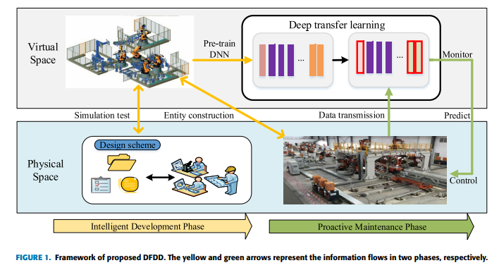
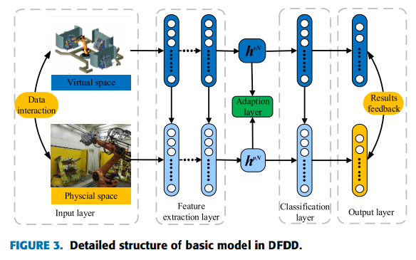

# A DIGITAL-TWIN-ASSISTED FAULT DIAGNOSIS USING DEEP TRANSFER LEARNING

[paper link](https://ieeexplore.ieee.org/abstract/document/8598879/)

### 문제

스마트팩토리의 제조공정에서 발생하는 오류는 매우 치명적이다. 특히 오류에 관한 데이터는 정상범위의 데이터에 비해 수가 매우 적기 때문에
모델을 학습하는 데 어려움을 겪는다. 기존의 오류 진단 방법들은 주로 trian데이터와 test데이터가 같은 분포에서 오며 충분한 데이터가
있다는 전재 하에 학습을 진행하지만, 실제 오류에 대한 데이터는 충분하지 않다. 본 논문에서는 deep transfer learning(DFDD)을 적용한
two-phase digital-twin-assisted fault diagnosis 방법을 사용하여 문제를 해결한다. 

### 방법

다음 그림은 제안하는 DFDD기반 two-phase digital-twin-assisted fault diagnosis방법을 나타낸 그림이다.

>phase 1

본 논문의 핵심은 virtual space의 가상 시뮬레이션 데이터의 활용이다. 본 논문에서는 부족한 fault데이터를 보완하기 위해
viertual space의 가상 시뮬레이션에서 생성된 데이터를 통해 pre-trained DNN모델을 생성한다. 여기서 시뮬레이션은
실제 physical space의 데이터를 통해 test되어진다.

>phase 2

pre-trained DNN 모델은 Deep transfer learning을 통해 전이학습이 수행된다. 여기서는 virtual space의 데이터와
physical space의 데이터를 융합하여 사용한다. 

phase 2의 학습은 위 그림에서처럼 virtual space의 데이터와 physical space의 데이터가 deep transfer learning 모델 각각의 layer에서
학습 결과를 공유하며 수행된다.

phase 1은 intelligent development phase, phase 2는 proactive maintenance phase이다.

### 공헌

본 논문에서는 다른 분포를 가진 데이터를 조합하여 학습을 수행했다. 이때 부족한 분포의 오류 데이터를 가상데이터를 활용하여 보충하였다.
실제 공정의 환경에맞게 phase를 분리하여 아키텍쳐를 구성하였다.
### 의견

가상공간의 데이터는 현실의 데이터와 다른 분포를 가질텐데, 이를 위해 현실의 데이터를 test로 사용하여 모델을 학습한점, 그리고 
DFDD에서 두 데이터를 효과적으로 융합하여 학습한 점은 참신하다. 또한 실제 환경의 구성에 맞게 phase를 나누어 가상공간을 활용하고,
여기서 데이터를 학습하여 실제 환경에서 유지보수에 사용한점 또한 잘 구성된 것 같다.
