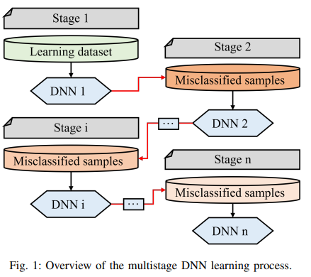
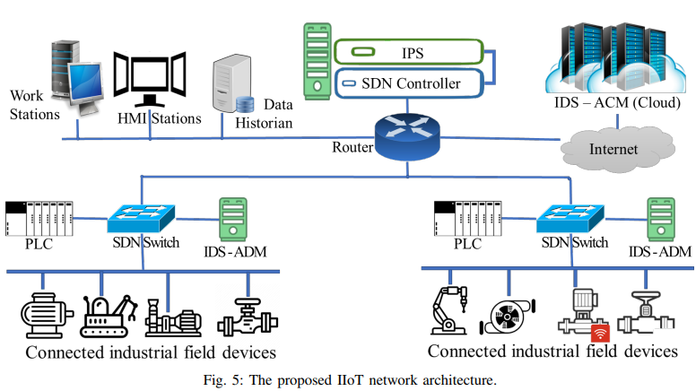

# A HIBRID MULTISTAGE DNN-BASED COLLABORATIE IDPS FOR HIGH-RISK SMART FACTORY NETWORKS

[paper link](https://ieeexplore.ieee.org/abstract/document/9870166?casa_token=r7LkxCDkMmsAAAAA:dvMToFYNJTt9wpGjLeJEflSI2uYmgQvtLRLbFIQPkWPmd6QoIMpjOYzYAGSyhQKVcjTumdXxivM)

### 문제

Industrial Internet of Things(IIoT)에 의해 현대화된 Industrial Control System(ICS)는 IIoT의 보안 취약성에 의해 사이버 공격에 자주 노출된다.
따라서 ICS를 보호하기 위한 Intrudion detection system(IDSs)들이 제안되었으며, 다수의 연구가 머신러닝, 특히 DNN을 기반으로 한다.
기존의 DNN기반 연구들은 단일 딥러닝 모델에 의존하기때문에 매우 가볍지만 복잡한 침입패턴에 대응하기 어렵다. 
또한, 사이버 보안에서 발생하는 데이터는 매우 불균형하기 때문에 단일 딥러닝 모델은 특정 패턴을 학습하는데 효과적이지 않다.
본 논문에서는 보안 강도와 시간지연문제가 모두 중요한 ICS보안을 위해 hibrid multistage dnn-based intrusion detection and prevention system(IDPS)
를 제안한다. 또한 제안하는 multistage DNN을 적용하여 이상 탐지 즉시 공격을 자동으로 완화시키는 공격대응 스키마를 갖춘
collaborative intrusion prevention system(IPS)를 제안한다.

### 방법

본 논문에서 제안하는 multistage DNN 시스템은 매우 심플하다. stage1에서 데이터를 학습후 DNN으로 분류를 하고, 잘못분류된 샘플에 대해
stage 2에서 학습 및 분류를한다. 이 과정을 n개의 stage에서 반복하여 분류 성능을 강화시킨다.

collaborative IPS는 크게 라우터에 위치하는 IPS와 엣지에 위치하는 IDS로 구성되어 있다. IDS는 엣지 단말 근처에서 침입에 대한 알림을 담당하며
IPS는 탐지에 대한 방어행동을 작동시킨다.

### 공헌

본 논문에서는 multistage DNN의 제안을 통해 cyber attack을 매우 높은 정확도로 감지해냈다. 
매우 가벼운 simple hibrid DNN model을 사용하였기 때문에 탐지 속도와 높은 정확도를 모두 얻었다

### 의견

application 관점에서, 높은 연산량을 요구하는 깊은 모델없이 문제를 단순하면서도 효과적으로 해결하였다. real-word의 문제를 해결하는 것은 연구와는 다른 관점에서다는 보아야
한다는 좋은 연구.
