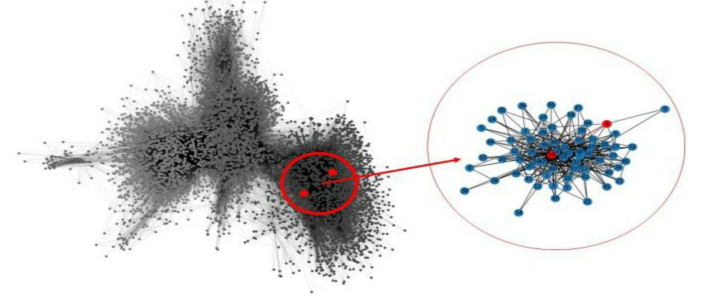
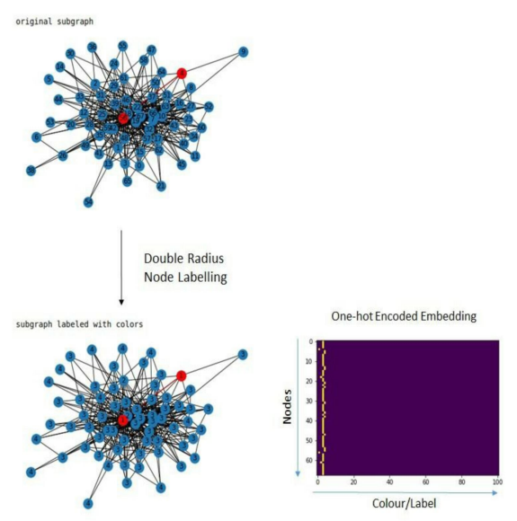
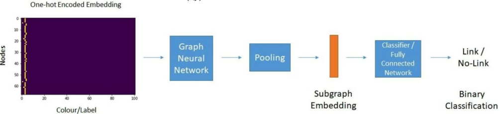

# A MACHINE LEARNING APPROACH FOR PREDICTING HIDDEN LINKS IN SUPPLY CHAIN WITH GRAPH NEURAL NETWOKRS
[paper link](https://www.tandfonline.com/doi/full/10.1080/00207543.2021.1956697)

### 문제

supply chain의 중단은 최근 질병의 발생과 수에즈 운하 차단과 같은 원인들에 의해 일어나 그 위험성을 각인시켰다.
연구자들은 정확한 대응을 위해 공급업체간의 상호의존성에 대한 가시성을 확보하는 것이 중요하다고 강조하였다.
하지만 공급업체 설문 조사와 같은 기존 방법은 정확성이 떨어지며 쉽게 검증할 수 없기 때문에 본 논문에서는 머신러닝중에서도
링크 예측 문제로 공급망 가시성 문제를 제기하고, graph neural network(GNN)을 통해 구매자가 알 수 없는 잠재적 링크를 예측하는
방법을 제안한다.

### 방법

본 논문에서 제안하는 GNN기반 link prediction은 다음과 같은 단계를 거친다.

전체 공급망 네트워크에서 서브 그래프 추출

서브 그래프에 깊이에 따라 레이블링 후 원핫 임베딩

GNN을 통해 링크 노드(공급망)간 링크 확률 예측

### 공헌

GNN기반의 네트워크링크예측을 공급망 문제에 적용하여 해결하였다. 

### 의견

아주 단순한 GNN기반 예측을 통해 문제를 해결하였기 때문에 최근 다양한 기술을 적용해볼 여지가 있다. 공급망 예측은 가능하지만
어떠한 이유로 해당 공급망을 예측하였는지 설명 불가, 문제에 따라서 설명가능성이 중요한 경우가 있다.
