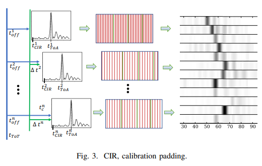
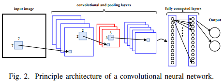

# CONVOLUTIONAL NEURAL NETWORKS FOR POSITION ESTIMATION IN TDOA-BASED LOCATING SYSTEMS

[paper link](https://ieeexplore.ieee.org/abstract/document/8533766?casa_token=URnTYBLATBEAAAAA:DdJsRGvy0AdrciiD44bqOGoxmzavmi7BMYReOT49KAF-NMOVd2hNISDnWmQZnR0odTg6mpKHaOU)

### 문제

이커머스, 스마트팩토리들의 가장 큰 고민중 하나는 물류 문제이다. 물류와 배송은 고비용 고인력을 요구하기 때문에 아마존에서 fulfillment system을 제안.
fulfillment system은 사업자의 물건을 플랫폼에서 맡아 대신 배송. 여기서 물류센터의 규모가커질수록 물건을 찾는데 매우 효율이 떨어지게 된다. 
물건을 찾기위해 주로사용되는 UWB(ultra-wideband)기술은 GPS에 비해 수십cm이내의 측위 정확성, multipath 등의 간섭에 대한 저항성, PHY layer와 난수를 활용한 보안성을 가진다.

UWB를 활용해 위치를 추정하는 time of arrival(ToA)방식은 송신기에서 빛을 쏘아 수신기에서 반사되 돌아오는 시간을 측정하고, 빛의 속도를 곱하여
거리를 구하는 방식이다. 하지만 장애물이 많을때는 UWB신호가 Additive White Gaussian Noise(AWGN)에 의해 변형되어 위치추적성능이 감소한다.
기존의 신호 분해 기반 노이즈 제거 방식은 복잡한 연산 비용으로 실시간 추적에 적절하지 않음. 따라서 본 논문에서는 딥러닝 기반 신호분석 위치추적 방법을 제안한다.

### 방법

본 논문에서는 AWGN으로 인해 생기는 오차를 줄이기 위해 raw Channel Impulse Response(CIR)데이터를 입력으로 하고 물체의 좌표를 출력으로 하는
CNN 모델을 제안한다.

CIR데이터는 특정순간의 임펄스와 그에 상응하는 응답으로 이루어진 데이터를 의미한다.
즉, 매순간 임펄스 입력에 대한 응답의 합으로 표현이 가능하며, 이를 convolution형태로 표현 가능하다. 

논문에서는 단순한 CNN모델을 사용하여 분석한다. 

실험결과 단순 CNN모델을 적용하였을 때 복잡한 비선형 방적식 풀이 없이 준수한 성능을 보임

### 공헌

signal 데이터에 convolution 모델을 적용하여 문제를 해결하였다.

### 의견

본 논문에서는 특별한 방법론을 사용하진 않았지만 스마트 팩토리라는 분야에서 특정 데이터 CIR 분석문제를 해결하였기에 그에 대한 기여가 있는 것 같다.
