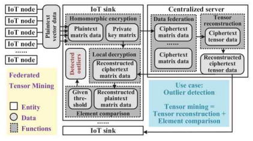

# FEDERATED TENSOR MINING FOR SECURE INDUSTRIAL INTERNET OF THINGS
[paper link](https://ieeexplore.ieee.org/abstract/document/8815886/?casa_token=DA6dfLRd47cAAAAA:326gGLPx9i4VBSvuap3nag_1Og6q9LXfgtVI8gC1CcxLo1cIcRfD4peUWMlH7dzy1g5XtGp6)

### 문제

스마트팩토리에서 사용하는 IoT센서는 일반적으로 서버로의 데이터 전송이 필수적이기 때문에 보안에 취약하다.
본 논문에서는 여러 공장에서 IoT센서에 의해 생성되는 대량의 데이터를 안전하게 처리하기 위한 연합학습 기반 동형암호 처리 프레임워크를 제안한다.

### 방법

본 논문에서 제안하는 연합학습 기반 동형암호 처리 프레임워크는 다음과 같다. IoT노드에서 수집된 데이터는 IoT sink에서 동형암호
private key에 의해 암호화된다. 이후 암호회된 데이터는 서버로 전송돼 그대로 모델을 학습하게된다. 서버의 모델은 암호화된 데이터를
학습하며 암호화된 데이터 또는 모델을 다시 IoT sink로 전송해 복호화를 하고 예측 등을 수행한다.

### 공헌

동형암호를 적용하여 다수의 노드를 기반으로 하는 연합학습의 보안문제 해결을 위한 프레임워크를 제안하였다.

### 의견

본 논문에서는 연합학습에 적합한 동형암호 적용 프레임워크를 제안하였지만, 실제로 동형암호를 딥러닝 모델에까지 적용하여 사용하는데 어려움이 있고
서버에서의 동형암호로 인한 학습시간과 데이터 양이 크게 증가하기 때문에 빠른 모델 업데이트와 이상탐지를 요구하는 스마트 팩토리에서의 적용에는
문제가 있다고 본다. 또한 IoT sink의 역할은 암호화와 복호화를 모두 가지고 있는데, IoT sink는 엣지 디바이스이기 때문에 resource 관점에서도 고려해야한다.
