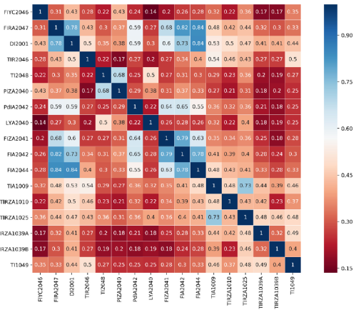
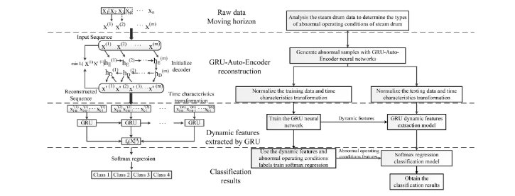

# GRU-Auto-Encoder neural network based methods for diagnosing abnormal operating conditions of steam drums in coal gasification plants

[paper link](https://www.sciencedirect.com/science/article/pii/S0098135420305949)

### 문제

Coal gasification plant는 석탄과 물, 산소를 이용해 합성가스(CO, H2)등의 부산물을 만드는 공정이다. 증기드럼은 coal gasification plant의 핵심 공정이며
비정상적인 작동 조건을 정확하게 진단하고 예측하는 것이 중요하다. 자세하게, 스팀드럼은 coal gasifier에 steam과 water를 공급하는데, stable한 공정에서는
steam drum의 양을 6~70%로 유지하는게 중요하다. steam drum의 양을 결정하는 요인에는 gasifier, boiler, emergency drain valve 등이 있다.
대부분 스마트 팩토리의 실제 현장에서는 전문가에의해 공정 데이터의 이상 여부를 판단하기 때문에 본 논문에서는 학습 모델에 기반하여 이를 예측하고자 한다.
steam drum 데이터는 이상 데이터의 불균형 문제가 있기 때문에 GRU-Auto-Encoder로 sequence를 고려한 abnormal data를 만들어 학습에 사용한다.

### 방법

본 논문에서는 유의미한 feature 선택을 위해 mic 상관관계분석을 수행했다. 상관관계분석은 변수의 변화량에 따른 분석이기 때문에, 자연스럽게 sequence에 대한
정보를 반영할 수 있다.

프로세스는 위 그림과 같다. 먼저 데이터 전처리단계에서 입력 데이터에 대한 sequence를 생성하여 GRU-Auto-Encoder를 학습한다.
이때 학습단계에서는 normal+abnormal의 일반적인 데이터를 학습하며, abnormal데이터를 reconstruction한다. 
GRU-Auto-Encoder를 통해 sequence를 가진 abnormal데이터가 충분히 축적되었을 때, 기존 데이터와 생산된 데이터를 사용하여
별도의 GRU classification 모델을 학습한다.

### 공헌

석탄 가스화 공정의 스팀드럼 데이터의 sequence를 반영한 주요 변수를 파악하기 위해 상관관계분석을 사용했다.
GRU-Auto-Encoder를 통해 부족한 이상데이터를 생산하고 GRU classifier를 학습하여 이상탐지를 시도했다.

### 의견

encoder의 역할에 충실하게 이상데이터를 생산하는데 사용했다. 특히 sequence가 반영된 데이터를 효과적으로 생산할 수 있음을 보였다. 
